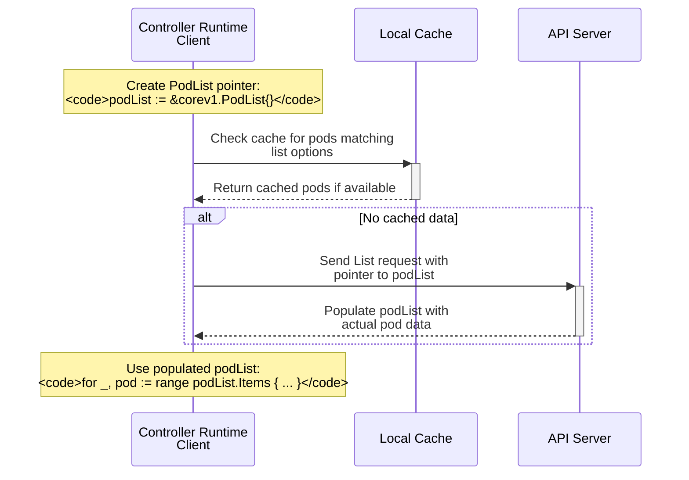

The diagram illustrates several important concepts:

1. **Local Cache Interaction**: 
          - The controller-runtime client first checks its local cache for matching pods 1:14
  - This improves performance by avoiding unnecessary API server calls
  - The cache is particularly useful for frequently accessed resources

2. **Pointer Importance**:
          - When sending the List request, the pointer to `podList` allows the API server to directly modify our structure
  - Without this pointer, there would be no way for the server to return the populated list
  - This is why passing a value without & would fail

3. **Data Flow**:
          - After the API server populates the `podList`, we can immediately iterate over its contents
  - The same pointer is used throughout the process, ensuring consistency
  - This design enables efficient memory usage and avoids unnecessary copying

This pattern is fundamental to how Kubernetes clients handle resource listing operations, combining efficiency through caching with reliable data retrieval through proper pointer handling.